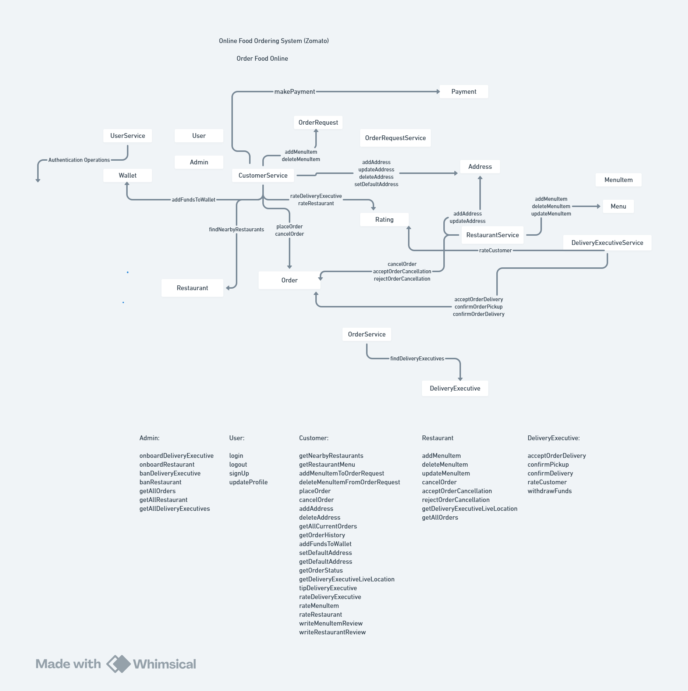

---

# Zomato Backend Clone – Spring Boot

A backend system that simulates the core functionality of an online food ordering platform similar to **Zomato**.

The system allows customers to browse restaurants, place food orders, track deliveries, make payments, and rate restaurants and delivery executives.

This project demonstrates backend system design for a food delivery platform using **Java and Spring Boot**, focusing on domain-driven service architecture, REST API design, and transactional workflows.

---

# Application Overview

The system supports the complete food ordering workflow including:

* browsing nearby restaurants
* viewing restaurant menus
* placing orders
* assigning delivery executives
* tracking order lifecycle
* making payments
* rating restaurants and delivery executives

The backend is structured around domain services responsible for different parts of the system such as customers, restaurants, orders, and delivery operations.

---

# Features

### Customer

* find nearby restaurants
* view restaurant menus
* add items to order request
* place orders
* cancel orders
* track order status
* rate restaurants
* rate delivery executives
* add and manage addresses
* add funds to wallet

---

### Restaurant

* add menu items
* update menu items
* delete menu items
* accept or reject order cancellations
* view orders

---

### Delivery Executive

* accept delivery orders
* confirm order pickup
* confirm order delivery
* update live location
* withdraw wallet funds
* rate customers

---

### Admin

* onboard restaurants
* onboard delivery executives
* ban restaurants
* ban delivery executives
* view system orders
* view all restaurants
* view delivery executives

---

# Tech Stack

### Backend

* Java
* Spring Boot
* Spring Data JPA
* Spring Security
* REST APIs

---

### Authentication

* JWT Token Based Authentication
* Role Based Authorization

---

### Database

* PostgreSQL
* PostGIS extension (for geospatial queries)

---

### Tools

* Maven
* Swagger UI

---

# System Architecture

The backend follows a **service-oriented layered architecture**.

Major domain services include:

* **UserService** – authentication and user management
* **CustomerService** – customer operations
* **RestaurantService** – restaurant and menu management
* **OrderRequestService** – temporary order building
* **OrderService** – order lifecycle management
* **DeliveryExecutiveService** – delivery operations
* **Wallet** – payment handling
* **Rating** – rating and feedback

Each service encapsulates domain logic related to its entity.

---

# Architecture Diagram



---

# Food Ordering Workflow

The process of ordering food follows these steps.

---

### Step 1 — Customer discovers restaurants

Customer searches for nearby restaurants.

Customer endpoint:

```
GET /restaurants/nearby
```

CustomerService queries restaurants based on location.

---

### Step 2 — Customer views menu

Customer retrieves the menu of a restaurant.

```
GET /restaurants/{restaurantId}/menu
```

RestaurantService returns menu items.

---

### Step 3 — Customer builds order request

Customer creates an order request by adding menu items.

```
POST /orderRequest/addMenuItem
DELETE /orderRequest/removeMenuItem
```

OrderRequestService maintains the temporary order.

---

### Step 4 — Customer places order

```
POST /orders/placeOrder
```

The system:

1. validates the order
2. calculates total price
3. processes payment
4. creates the order

---

### Step 5 — Assign delivery executive

OrderService finds available delivery executives.

```
findDeliveryExecutives()
```

The order is assigned to a delivery executive.

---

### Step 6 — Delivery lifecycle

Delivery executive performs:

```
acceptOrderDelivery
confirmOrderPickup
confirmOrderDelivery
```

The order status changes accordingly.

---

# Order Lifecycle

Orders progress through the following states.

```
CREATED
ACCEPTED
PREPARING
OUT_FOR_DELIVERY
DELIVERED
CANCELLED
```

---

# Wallet and Payment

Customers maintain a wallet used for payments.

Wallet features:

* add funds
* debit funds during order placement
* refund during cancellations

Payment service processes transactions when placing orders.

---

# Address Management

Customers can manage multiple delivery addresses.

Operations include:

* add address
* update address
* delete address
* set default address

---

# Ratings System

Customers can rate:

* restaurants
* delivery executives

Delivery executives can rate customers.

Ratings help maintain service quality across the platform.

---

# Authentication & Authorization

The system uses **JWT based authentication**.

Authentication endpoints:

```
POST /signup
POST /login
```

After login, the server returns a **JWT token**.

All protected APIs require:

```
Authorization: Bearer <JWT_TOKEN>
```

Role-based access control ensures that:

* customers access customer APIs
* restaurants access restaurant APIs
* delivery executives access delivery APIs
* admins access admin APIs

---

# Core Entities

Main domain entities:

```
User
Customer
Restaurant
MenuItem
Order
OrderRequest
DeliveryExecutive
Wallet
Address
Rating
```

---

# Additional Components

The project also includes:

* Swagger API documentation
* GlobalExceptionHandler
* GlobalResponseHandler
* environment profiles (DEV, PROD)

---

# Running the Project

Clone the repository:

```
git clone https://github.com/lokesh2yss/Spring-Boot-Zomato-App
```

Navigate to the project directory:

```
cd Spring-Boot-Zomato-App
```

Run the application:

```
mvn spring-boot:run
```

Ensure PostgreSQL is running and configured in `application.properties`.

---

# Future Improvements

Potential improvements include:

* Redis caching for restaurant queries
* Kafka event-driven architecture
* real-time delivery tracking
* microservices architecture
* Docker containerization
* distributed order assignment

---

# Author

Lokesh Kumar

Senior Backend Engineer
Java | Spring Boot | Distributed Systems

LeetCode
[https://leetcode.com/u/lokeshtalks/](https://leetcode.com/u/lokeshtalks/)

---
